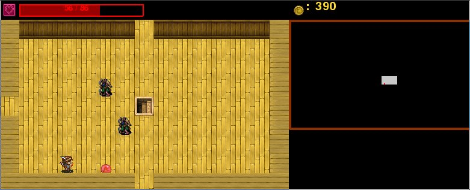

# Donjon-Python

Lancez Launcher.py



Le projet
=========
Ce projet est un projet d'ISN en terminal fait par moi
et 3 autres personnes :

Geoffrey Fradot (Moteur graphique)

Moi, Hugo Laloge (Génération du donjon)

Tristan Le Saux (Assets graphiques et sonores, menus)

Laure (Magasin et stats des personnages)

Installation des dépendances
============================

Sur Debian / dérivés :
Pygame pour python3

```
sudo apt-get install python3-pip
pip3 install pygame
```
